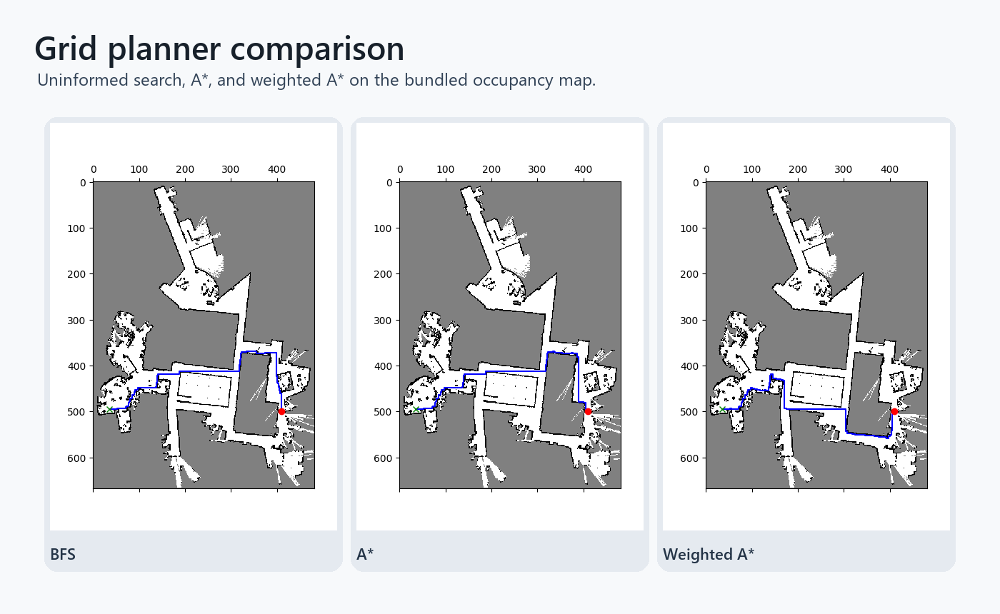

# Grid Path Planning: BFS, A*, and Weighted A*

Python implementation of grid-based path planning algorithms for a 4-connected occupancy map.

## Contents

- `scripts/assignment_1_astar.py` implements:
  - uninformed uniform-cost search with unit edge costs, equivalent to BFS on this grid
  - A* search with a Manhattan-distance heuristic
  - a faster weighted A* variant for quicker planning on large maps
- `scripts/example_test_case.py` runs the planners on a toy grid and on `map.png`.
- `map.png` is the example occupancy grid used by the larger smoke test.

## Assumptions

- Free cells have values greater than `0.9`; occupied cells are below that threshold.
- The robot moves only in the four cardinal directions.
- Every valid move has unit cost.
- If no valid path exists, the planner returns an empty path.
- The weighted A* planner trades optimality for speed by weighting the heuristic.

## Run

```bash
cd scripts
python example_test_case.py
```

The example script writes path visualizations for each planner.

## Result screenshots



Planner comparison across uninformed search, A*, and weighted A* on the provided map.


## What this demonstrates

- Search behavior tradeoffs between BFS-style expansion, A*, and weighted A*.
- Occupancy-map loading and visual path export from a compact Python implementation.
- Instrumentation for path length, explored nodes, and runtime.


## Limitations and next steps

- The planner uses a 4-connected grid and does not model continuous robot geometry.
- Weighted A* is faster but may produce a less optimal path.
- Next steps: add diagonal motion, obstacle inflation, and benchmark summaries.

